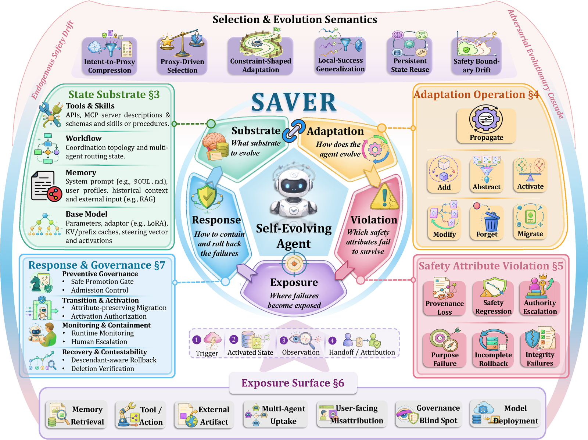

# Awesome Self-Evolving Agent Safety

A survey repository for **"Safety in Self-Evolving Agents: A Survey"** — a transition-centered study of how reusable influence persists, moves, and changes role across carriers in self-evolving agents.

[](https://github.com/xaddwell/Awesome-Self-Evolving-Agent-Safety)
[](https://xaddwell.github.io/Awesome-Self-Evolving-Agent-Safety/)

## Paper

- **Title:** Safety in Self-Evolving Agents: A Survey
- **Authors:** Jiahao Chen, Zhou Feng, Oubo Ma, Yichen Yan, Ruixiao Lin, Hangtao Zhang, Linkang Du, Yiming Li, Hengyu An, Jun Liu, Junhao Li, Naen Xu, Mengyao Du, Yuanyi Song, Chunyi Zhou, Tianyu Du, Yuan Su, Zehao Jin, Qianli Ma, Leyi Qi, Yiming Wang, Zhihui Fu, Jun Wang, Zhe Ma, Yuwen Pu, Jinfeng Li, Shouling Ji
- **PDF:** [`assets/SAVER-Survey.pdf`](assets/SAVER-Survey.pdf)

## Overview

Self-evolving agents turn observations, feedback, and execution traces into reusable state that shapes later behavior. SAVER is a transition-centered framework that analyzes this safety problem through the relation **S×A → V→E→R**: Substrate and Adaptation identify the carrier-operation pair that changes reusable state, while Violation, Exposure, and Response connect an internal safety failure to observable evidence and the mechanism claimed to contain or repair it.



## Key Insights

1. Many safety failures originate not from harmful information, but from unsafe transitions that elevate the persistence, authority, or scope of otherwise legitimate state.
2. Existing research is effective at controlling unsafe admission and visible failures, yet lacks mechanisms for tracking influence lineage across migration, propagation, and recovery.
3. Future evaluations should move beyond endpoint-based metrics toward lifecycle-level evidence that unsafe influence is traced, contained, and prevented from re-emerging after continued adaptation.

## Figures

- **Temporal distribution and SAVER flow of the literature** through 7 August 2026 — [`assets/img/fig_literature_flow.png`](assets/img/fig_literature_flow.png)
- **SAVER literature roadmap** (substrate → operation path → violation/exposure and response evidence) — [`assets/img/fig_roadmap.png`](assets/img/fig_roadmap.png)
- **Cross substrate transmutation** — [`assets/img/fig_transmutation.png`](assets/img/fig_transmutation.png)
- **From output safety to adaptive state safety** — [`assets/img/fig_output2state.png`](assets/img/fig_output2state.png)
- **Safety attribute laundering lattice** — [`assets/img/fig_lattice.png`](assets/img/fig_lattice.png)

## Repository Structure

```
.
├── index.html              # Project page (mirrored on xaddwell.github.io)
├── assets/
│   ├── SAVER-Survey.pdf    # Paper PDF
│   ├── saver.bib           # BibTeX entry
│   └── img/                # Figure images exported from the LaTeX sources
└── README.md
```

## Citation

```bibtex
@article{chen2026saver,
  title={Safety in Self-Evolving Agents: A Survey},
  author={Chen, Jiahao and Feng, Zhou and Ma, Oubo and Yan, Yichen and Lin, Ruixiao and Zhang, Hangtao and Du, Linkang and Li, Yiming and An, Hengyu and Liu, Jun and Li, Junhao and Xu, Naen and Du, Mengyao and Song, Yuanyi and Zhou, Chunyi and Du, Tianyu and Su, Yuan and Jin, Zehao and Ma, Qianli and Qi, Leyi and Wang, Yiming and Fu, Zhihui and Wang, Jun and Ma, Zhe and Pu, Yuwen and Li, Jinfeng and Ji, Shouling},
  year={2026},
  note={Preprint}
}
```

## License

The figure assets and paper PDF in this repository are derived from the survey manuscript and are provided for presentation purposes. Contact the corresponding author (xaddwell@zju.edu.cn) for reuse beyond citation.
